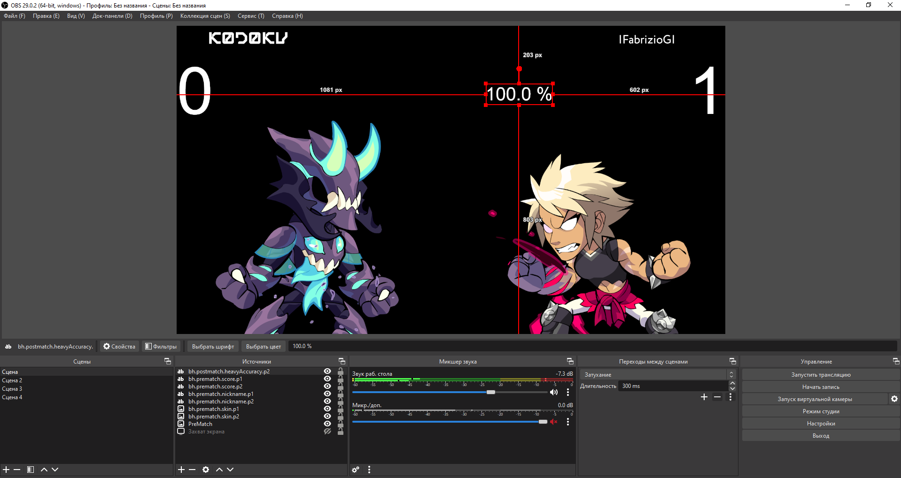

# OBS-Brawlhalla-Tournament-websockets

Прототип программы для вывода результатов матча в Brawlhalla в OBS.

Реализация: **python 3.9** + **OBS-Websockets**


## Параметры OBS-Websockets
Параметры расположены в файле `config.json`
```json
{
    "host": "localhost",
    "port": 4455,
    "password": "********"
}
```

## Поддерживаемые режимы игры
- **1vs1**
- **2vs2**


## Мод источника "Text (GDI+)"
Для вывода текста рекомендуется использовать модифицированный источник `Text (GDI+) (Brawlhalla-tournament)`, который приложен к данному плагину

##### Преимущества модификации:
- Улучшение центровки текста (При свободных размерах текстового поля)


## Типы источников
- **Текст** - Изменяется содержимое поля `Текст`
- **Изображение** - Изменяется содержимое поля `Файл изображения`

### Рекомендуемые параметры источников
#### Текст
|  Параметр  |  Значение   |
| :------------: | :------------: |
| Свои размеры текста | ✅ |
| Выравнивание по горизонтали | Центральное |
| Выравнивание по вертикали | Центральное |

#### Изображение
##### Преобразовать-Изменение преобразования
|  Параметр  |  Значение   |
| :------------: | :------------: |
| Тип ограничения | Максимальный размер |
| Выравнивание внутри ограничителя | По центру |

##### Для отражения по горизонтали
Преобразовать-Изменение преобразования-Отразить по горизонатли


## Экраны

- **Прематч** - Информация обновляется перед началом матча
  (Когда были выбраны персонажи всеми игроками и игра была запущена)
- **Инматч** - Информация обновляется во время матча
- **Постматч** - Информация обновляется после окончания матча


## Источники

Плагин производит поиск по всем доступным источникам и исходя из их названия изменяет содержимое.

#### [dst] - Точка назначения:
- **1vs1**:
    - `p1` - Первый игрок
    - `p2` - Второй игрок
- **2vs2:**
    - `t1` - Первая команда
    - `t2` - Вторая команда
    - `t1.p1` - Первый игрок первой команды
    - `t1.p2` - Второй игрок первой команды
    - `t2.p1` - Первый игрок второй команды
    - `t2.p2` - Второй игрок второй команды

##### Пример
- `bh.prematch.nickname.p1` - Никнейм первого игрока
- `bh.prematch.nickname.p2` - Никнейм второго игрока
- `bh.inmatch.score.p1` - Счёт первого игрока
- `bh.inmatch.score.t1` - Счёт первой команды
- `bh.postmatch.damageTaken.p1` - Нанесённый урон первого игрока
- `bh.postmatch.damageTaken.t2` - Нанесённый урон второй командой
- `bh.postmatch.damageTaken.t1.p2` - Нанесённый урон второго игрока первой команды

#### [weapon] - Идентификатор оружия:
- `u` - Без оружия
- `w1` - Первое оружие
- `w2` - Второе оружие

#### [attack] - Тип атаки
- `throw`
- `recovery`
- `gp`
- `nLight`
- `sLight`
- `dLight`
- `nAir`
- `sAir`
- `dAir`
- `nHeavy`
- `sHeavy`
- `dHeavy`
- 
##### Пример
- `bh.postmatch.u.nAir.enemyDamage.p1` - Нанесено урона nAir-ом первым игроком без оружия
- `bh.postmatch.w1.nLight.uses.p2` - Количество использований nLight-атак первого оружия вторым игроком


### Прематч

|    Название источника    | Тип источника | p[1;2] | t[1;2] | t[1;2].p[1;2] |        Описание        | Реализовано |
|:------------------------:|:-------------:|:------:|:------:|:-------------:|:----------------------:|:-----------:|
| **bh.prematch.nickname** |    *Текст*    |   ✔    |   ❌    |       ✔       |     Никнейм игрока     |      ✔      |
|    **bh.prematch.id**    |    *Текст*    |   ✔    |   ❌    |       ✔       |      Айди игрока       |      ✔      |
|  **bh.prematch.score**   |    *Текст*    |   ✔    |   ❌    |       ✔       |          Счёт          |      ✔      |
|   **bh.prematch.skin**   | *Изображение* |   ✔    |   ❌    |       ✔       |      Скин игрока       |      ✔      |
|   **bh.prematch.face**   | *Изображение* |   ✔    |   ❌    |       ✔       | Миниатюра скина игрока |      ✔      |


### Инматч

|   Название источника    | Тип источника | p[1;2] | t[1;2] | t[1;2].p[1;2] |        Описание        | Реализовано |
|:-----------------------:|:-------------:|:------:|:------:|:-------------:|:----------------------:|:-----------:|
| **bh.inmatch.nickname** |    *Текст*    |   ✔    |   ❌    |       ✔       |     Никнейм игрока     |      ✔      |
|    **bh.inmatch.id**    |    *Текст*    |   ✔    |   ❌    |       ✔       |      Айди игрока       |      ✔      |
|  **bh.inmatch.score**   |    *Текст*    |   ✔    |   ❌    |       ✔       |          Счёт          |      ✔      |
|   **bh.inmatch.skin**   | *Изображение* |   ✔    |   ❌    |       ✔       |      Скин игрока       |      ✔      |
|   **bh.inmatch.face**   | *Изображение* |   ✔    |   ❌    |       ✔       | Миниатюра скина игрока |      ✔      |


### Постматч

|            Название источника             | Тип источника | p[1;2] | t[1;2] | t[1;2].p[1;2] |                 Описание                  | Реализовано |
|:-----------------------------------------:|:-------------:|:------:|:------:|:-------------:|:-----------------------------------------:|:-----------:|
|      **bh.postmatch.nickname.[dst]**      |    *Текст*    |   ✔    |   ❌    |       ✔       |              Никнейм игрока               |      ✔      |
|         **bh.postmatch.id.[dst]**         |    *Текст*    |   ✔    |   ❌    |       ✔       |                Айди игрока                |      ✔      |
|       **bh.postmatch.score.[dst]**        |    *Текст*    |   ✔    |   ❌    |       ✔       |                   Счёт                    |      ✔      |
|        **bh.postmatch.skin.[dst]**        | *Изображение* |   ✔    |   ❌    |       ✔       |                Скин игрока                |      ✔      |
|        **bh.postmatch.face.[dst]**        | *Изображение* |   ✔    |   ❌    |       ✔       |          Миниатюра скина игрока           |      ✔      |
|     **bh.postmatch.timeOnWall.[dst]**     |    *Текст*    |   ✔    |   ❌    |       ✔       |              Время на стене               |      ✔      |
|    **bh.postmatch.timeOnGround.[dst]**    |    *Текст*    |   ✔    |   ❌    |       ✔       |              Время на земле               |      ✔      |
|     **bh.postmatch.timeOnAir.[dst]**      |    *Текст*    |   ✔    |   ❌    |       ✔       |              Время в воздухе              |      ✔      |
|    **bh.postmatch.damageTaken.[dst]**     |    *Текст*    |   ✔    |   ❌    |       ✔       |              Нанесённый урон              |      ✔      |
|    **bh.postmatch.damageDealt.[dst]**     |    *Текст*    |   ✔    |   ❌    |       ✔       |              Полученный урон              |      ✔      |
|  **bh.postmatch.teamDamageTaken.[dst]**   |    *Текст*    |   ❌    |   ❌    |       ✔       |     Нанесённый урон по члену команды      |      ✔      |
|  **bh.postmatch.teamDamageDealt.[dst]**   |    *Текст*    |   ❌    |   ❌    |       ✔       |     Полученный урон от членов команды     |      ✔      |
|      **bh.postmatch.teamKOs.[dst]**       |    *Текст*    |   ❌    |   ❌    |       ✔       |     Количество убийств членов команды     |      ✔      |
|      **bh.postmatch.suicides.[dst]**      |    *Текст*    |   ✔    |   ❌    |       ✔       |          Количество самоубийств           |      ✔      |
|        **bh.postmatch.KOs.[dst]**         |    *Текст*    |   ✔    |   ❌    |       ✔       |            Количество убийств             |      ✔      |
|       **bh.postmatch.deaths.[dst]**       |    *Текст*    |   ✔    |   ❌    |       ✔       |            Количество смертей             |      ✔      |
|     **bh.postmatch.airDodges.[dst]**      |    *Текст*    |   ✔    |   ❌    |       ✔       |      Количество уклонений в воздухе       |      ✔      |
|       **bh.postmatch.dashes.[dst]**       |    *Текст*    |   ✔    |   ❌    |       ✔       |             Колчисетво дэшей              |      ✔      |
|    **bh.postmatch.totalDodges.[dst]**     |    *Текст*    |   ✔    |   ❌    |       ✔       |              Всего уклонений              |      ✔      |
|      **bh.postmatch.airJumps.[dst]**      |    *Текст*    |   ✔    |   ❌    |       ✔       |       Количество прыжков в воздухе        |      ✔      |
|     **bh.postmatch.dashJumps.[dst]**      |    *Текст*    |   ✔    |   ❌    |       ✔       |          Количество дэш-прыжков           |      ✔      |
|     **bh.postmatch.totalJumps.[dst]**     |    *Текст*    |   ✔    |   ❌    |       ✔       |               Всего прыжков               |      ✔      |
|      **bh.postmatch.clashes.[dst]**       |    *Текст*    |   ✔    |   ❌    |       ✔       |             Количество кдэшей             |      ✔      |


#### Статистика по оружиям/атакам

|                   Название источника                   | Тип источника | p[1;2] | t[1;2] | t[1;2].p[1;2] |                   Описание                   | Реализовано |
|:------------------------------------------------------:|:-------------:|:------:|:------:|:-------------:|:--------------------------------------------:|:----------:|
|          **bh.postmatch.[weapon].icon.[dst]**          | *Изображение* |   ✔    |   ❌    |       ✔       |                Иконка оружия                 |      ✔     |
|        **bh.postmatch.[weapon].timeHeld.[dst]**        |    *Текст*    |   ✔    |   ❌    |       ✔       |             Время использования              |      ✔     |
|      **bh.postmatch.[weapon].damageTaken.[dst]**       |    *Текст*    |   ✔    |   ❌    |       ✔       |        Полученный урон на этом оружии        |      ✔     |
|     **bh.postmatch.[weapon].[attack].uses.[dst]**      |    *Текст*    |   ✔    |   ❌    |       ✔       |           Количество использований           |      ✔     |
|   **bh.postmatch.[weapon].[attack].enemyHits.[dst]**   |    *Текст*    |   ✔    |   ❌    |       ✔       |             Количество попаданий             |      ✔     |
|  **bh.postmatch.[weapon].[attack].enemyDamage.[dst]**  |    *Текст*    |   ✔    |   ❌    |       ✔       |               Нанесённый урон                |      ✔     |
|   **bh.postmatch.[weapon].[attack].enemyKOs.[dst]**    |    *Текст*    |   ✔    |   ❌    |       ✔       |              Количество убийств              |      ✔     |
|    **bh.postmatch.[weapon].[attack].GCUses.[dst]**     |    *Текст*    |   ✔    |   ❌    |       ✔       |         Количество использований ГЦ          |      ✔     |
|  **bh.postmatch.[weapon].[attack].GCEnemyHits.[dst]**  |    *Текст*    |   ✔    |   ❌    |       ✔       |           Количество попаданий ГЦ            |      ✔     |
| **bh.postmatch.[weapon].[attack].GCEnemyDamage.[dst]** |    *Текст*    |   ✔    |   ❌    |       ✔       |       Количество нанесённого урона ГЦ        |      ✔     |
|  **bh.postmatch.[weapon].[attack].GCEnemyKOs.[dst]**   |    *Текст*    |   ✔    |   ❌    |       ✔       |            Количество убийств ГЦ             |      ✔     |
|   **bh.postmatch.[weapon].[attack].teamHits.[dst]**    |    *Текст*    |   ✔    |   ❌    |       ✔       |    Количество попаданий по членам команды    |      ✔     |
|  **bh.postmatch.[weapon].[attack].teamDamage.[dst]**   |    *Текст*    |   ✔    |   ❌    |       ✔       |  Количство урона нанесённое членам команды   |      ✔     |
|    **bh.postmatch.[weapon].[attack].teamKOs.[dst]**    |    *Текст*    |   ✔    |   ❌    |       ✔       |      Количество убийств членов команды       |      ✔     |
|  **bh.postmatch.[weapon].[attack].GCTeamHits.[dst]**   |    *Текст*    |   ✔    |   ❌    |       ✔       |  Количество попаданий по членам команды ГЦ   |      ✔     |
| **bh.postmatch.[weapon].[attack].GCTeamDamage.[dst]**  |    *Текст*    |   ✔    |   ❌    |       ✔       | Количство урона нанесённое членам команды ГЦ |      ✔     |
|   **bh.postmatch.[weapon].[attack].GCTeamKOs.[dst]**   |    *Текст*    |   ✔    |   ❌    |       ✔       |     Количество убийств членов команды ГЦ     |     ✔      |


## Комбиноирование статистики
В файле `CustomStats.py` можно скомбинировать различные источники и дать им имена.

**Внимание, после добавления новых комбинаций и изменения старых - необходимо перезапустить программу!**

### Примеры:
#### Первый пример
Урон нанесённый без оружия - сложение урона каждой атаки
```python
from StatsCommandsTree import bhTree as bh

# Цель - Урон без оружия
bh.postmatch.u.damageDealt = (
    bh.postmatch.u.throw.enemyDamage +
    bh.postmatch.u.recovery.enemyDamage +
    bh.postmatch.u.gp.enemyDamage +
    bh.postmatch.u.nLight.enemyDamage +
    bh.postmatch.u.sLight.enemyDamage +
    bh.postmatch.u.dLight.enemyDamage +
    bh.postmatch.u.nAir.enemyDamage +
    bh.postmatch.u.sAir.enemyDamage +
    bh.postmatch.u.dAir.enemyDamage +
    bh.postmatch.u.nHeavy.enemyDamage +
    bh.postmatch.u.sHeavy.enemyDamage +
    bh.postmatch.u.dHeavy.enemyDamage
)
```

После добавления этого блока в `CustomStats.py` - в источник под названием `bh.postmatch.u.damageDealt.[dst]` будет записан результат комбинирования.


#### Второй пример
Урон всех тяжёлых атак

```python
from StatsCommandsTree import bhTree as bh

# Урон тяжёлых атак без оружия
bh.postmatch.u.heavyDamageDealt = (
    bh.postmatch.u.nHeavy.enemyDamage +
    bh.postmatch.u.sHeavy.enemyDamage +
    bh.postmatch.u.dHeavy.enemyDamage
)

# Урон тяжёлых атак на первом оружие
bh.postmatch.w1.heavyDamageDealt = (
    bh.postmatch.w1.nHeavy.enemyDamage +
    bh.postmatch.w1.sHeavy.enemyDamage +
    bh.postmatch.w1.dHeavy.enemyDamage
)

# Урон тяжёлых атак на втором оружие
bh.postmatch.w2.heavyDamageDealt = (
    bh.postmatch.w2.nHeavy.enemyDamage +
    bh.postmatch.w2.sHeavy.enemyDamage +
    bh.postmatch.w2.dHeavy.enemyDamage
)

# Цель - сумма урона всех тяжёлых атак
bh.postmatch.totalHeavyDamage = (
    bh.postmatch.u.heavyDamageDealt + 
    bh.postmatch.w1.heavyDamageDealt +
    bh.postmatch.w2.heavyDamageDealt
)
```

#### Трерий пример
Аккуратность тяжёлых атак
```python
from StatsCommandsTree import bhTree as bh

# Количество тяжёлых атак без оружия
bh.postmatch.u.heavyUses = (
    bh.postmatch.u.nHeavy.uses +
    bh.postmatch.u.sHeavy.uses +
    bh.postmatch.u.dHeavy.uses
)

# Количество тяжёлых атак на первом оружии
bh.postmatch.w1.heavyUses = (
    bh.postmatch.w1.nHeavy.uses +
    bh.postmatch.w1.sHeavy.uses +
    bh.postmatch.w1.dHeavy.uses
)

# Количество тяжёлых атак на втором оружии
bh.postmatch.w2.heavyUses = (
    bh.postmatch.w2.nHeavy.uses +
    bh.postmatch.w2.sHeavy.uses +
    bh.postmatch.w2.dHeavy.uses
)

# Цель - Количество тяжёлых атак
bh.postmatch.totalHeavyUses = (
    bh.postmatch.u.heavyUses +
    bh.postmatch.w1.heavyUses +
    bh.postmatch.w2.heavyUses
)


# Количество попаданий тяжёлыми атаками без оружия
bh.postmatch.u.heavyHits = (
    bh.postmatch.u.nHeavy.enemyHits +
    bh.postmatch.u.sHeavy.enemyHits +
    bh.postmatch.u.dHeavy.enemyHits
)

# Количество попаданий тяжёлыми атаками на первом оружии
bh.postmatch.w1.heavyHits = (
    bh.postmatch.w1.nHeavy.enemyHits +
    bh.postmatch.w1.sHeavy.enemyHits +
    bh.postmatch.w1.dHeavy.enemyHits
)

# Количество попаданий тяжёлыми атаками на втором оружии
bh.postmatch.w2.heavyHits = (
    bh.postmatch.w2.nHeavy.enemyHits +
    bh.postmatch.w2.sHeavy.enemyHits +
    bh.postmatch.w2.dHeavy.enemyHits
)

# Цель - Количество попаданий тяжёлыми атаками
bh.postmatch.totalHeavyHits = (
    bh.postmatch.u.heavyHits +
    bh.postmatch.w1.heavyHits +
    bh.postmatch.w2.heavyHits
)

# Цель - Аккуратность тяжёлых атак
bh.postmatch.heavyAccuracy = (
    (bh.postmatch.totalHeavyHits / bh.postmatch.totalHeavyUses) * 100 + " %"
)
```



